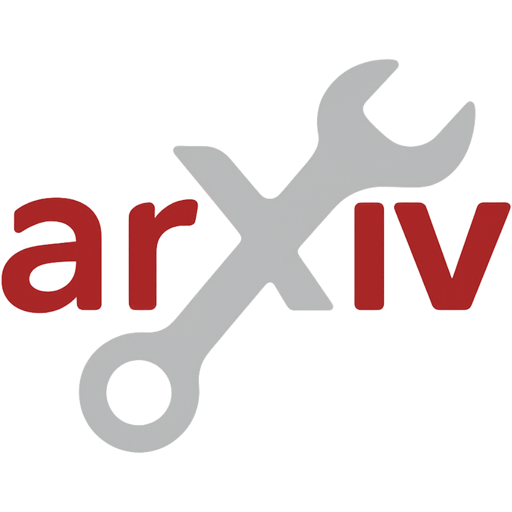
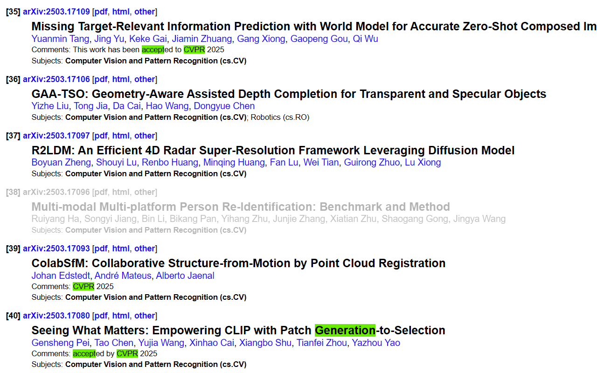
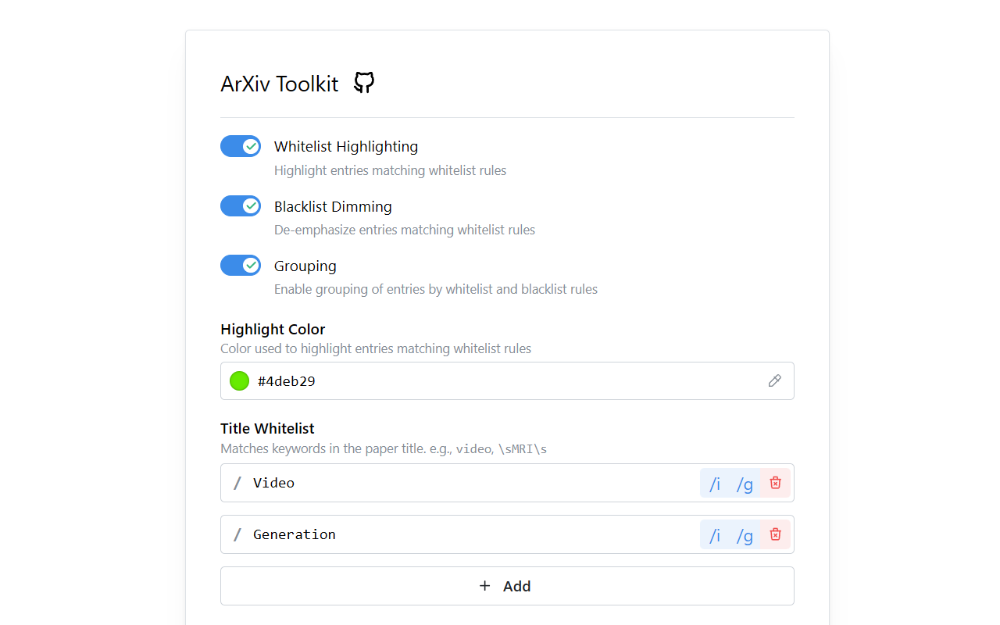

# ArXiv Toolkit

A Chrome/Edge extension to help you quickly scan through the flood of daily ArXiv papers.

### Introduction

Tired of skimming through 100+ AI papers every day? This extension helps you stay on top of the latest trends by:

- Highlighting or dimming papers based on custom keywords or regex rules.
- Reordering and grouping daily papers by matching topics or interests.

### Installation

- [Chrome Web Store](https://chromewebstore.google.com/detail/arxiv-toolkit/pjodeodbajecmlaofokdiifjlmhkkell)
- [Microsoft Edge Add-ons](https://microsoftedge.microsoft.com/addons/detail/arxiv-toolkit/flgiaicohcfkkhppkncegpahnlmakloc)

### Screenshots

### Tech Stack

This project is built using the following open-source frameworks:

- **[Plasmo Framework](https://docs.plasmo.com/)**: For building browser extensions.
- **[Mantine](https://mantine.dev/)**: For UI components and hooks.
- **[Tabler Icons](https://tabler-icons.io/)**: For iconography.

### Acknowledgments

Special thanks to Xin Huang for the logo inspiration.
